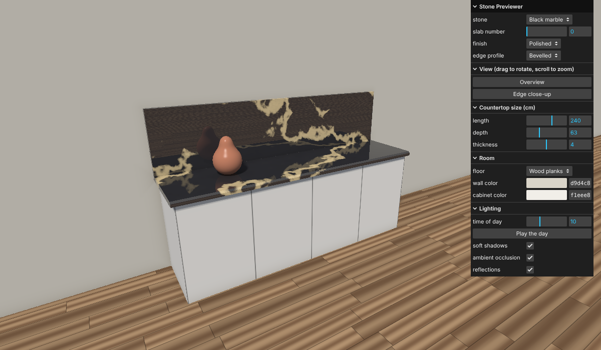

# Stone Previewer

Course project for Computer Graphics (University of Haifa, 2026).



A small web app that helps a customer in a stone shop decide **which edge profile and finish to
order** for a countertop. The customer picks a stone, an edge and a finish, sets the size and the
room, moves around the countertop, and moves the light from morning to evening.

The scene contains no triangles. It is drawn by **ray marching a signed distance function** in a
single fragment shader, the opposite approach to the rasterizer built in the course homework.

**Full report:** [REPORT.md](./REPORT.md)

## Run

Requires [Node.js](https://nodejs.org) and a browser with WebGL2.

```bash
npm install
npm run dev      # open the printed http://localhost:5173 address
npm run build    # type-check and production build
```

## Controls

- **Drag** to rotate around the countertop, **scroll** to zoom.
- **Stone:** white, black or green marble, or travertine; the slab number changes the vein pattern.
- **Finish:** polished, satin or matte.
- **Edge profile:** square, bevelled, rounded or bullnose.
- **Countertop size:** length, depth and thickness in centimetres.
- **Room:** floor (wood planks, tiles, concrete), wall color and cabinet color.
- **Lighting:** time of day, "Play the day", and switches for shadows, ambient occlusion and
  reflections.

Settings can also be given in the address bar to reproduce a picture, for example
`?stone=Black marble&edge=Bullnose&finish=Matte&floor=Tiles&time=16&length=300`.

## Code

| File | Contents |
| --- | --- |
| `src/shaders/sdf.glsl` | Distance functions for basic shapes, and the smooth minimum |
| `src/shaders/scene.glsl` | The room: `map(p)`, the slab and its edge profiles |
| `src/shaders/noise.glsl` | Perlin noise, FBm and turbulence |
| `src/shaders/materials.glsl` | Stone, wood planks, tiles, concrete and the cabinet |
| `src/shaders/lighting.glsl` | Phong reflection model, soft shadows, ambient occlusion |
| `src/shaders/raymarch.frag.glsl` | The ray marcher, normals, reflections and `main` |
| `src/camera.ts` | Orbit camera |
| `src/sun.ts` | Light direction and color for a time of day |
| `src/main.ts` | Settings, control panel and drawing |

## Open source used

[Vite](https://vite.dev), [TypeScript](https://www.typescriptlang.org) and
[lil-gui](https://lil-gui.georgealways.com) (the control panel).
