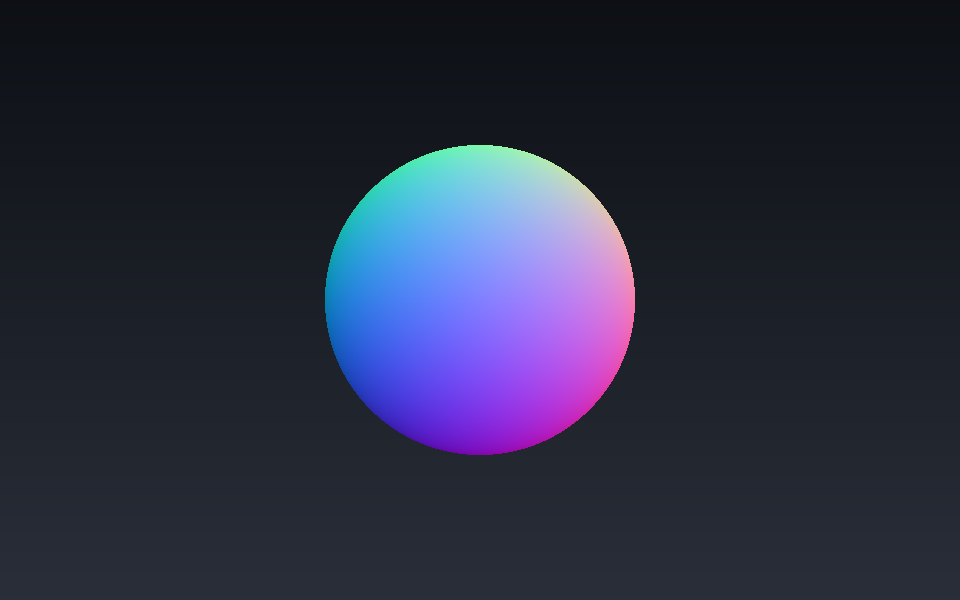
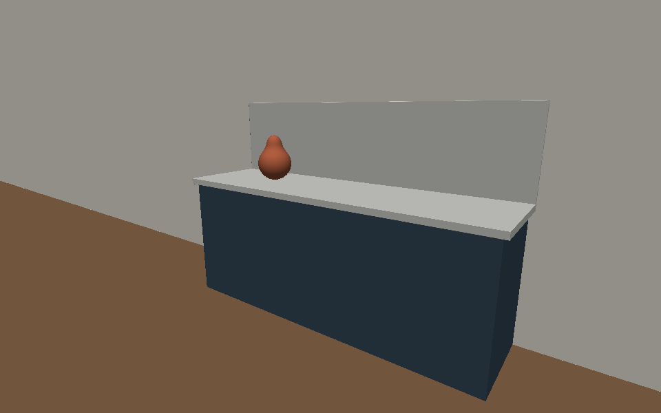
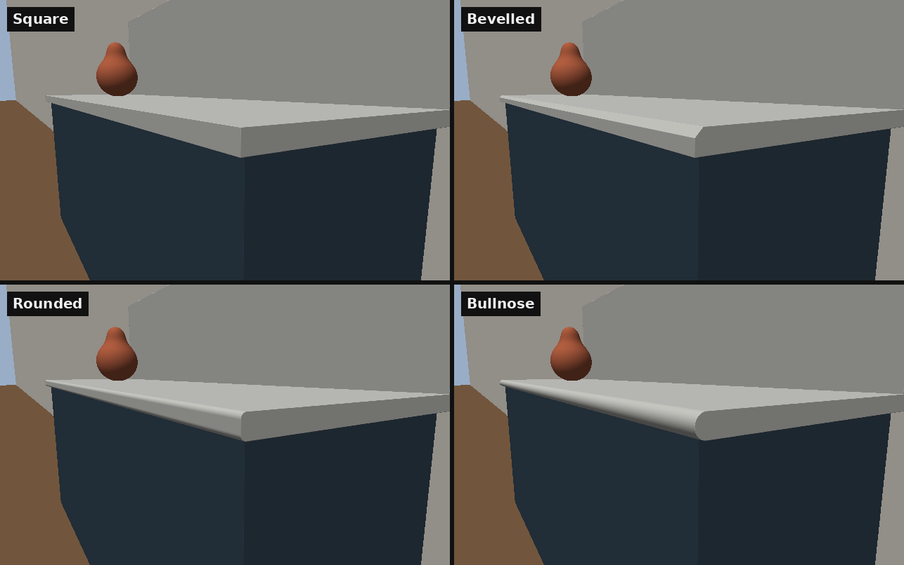
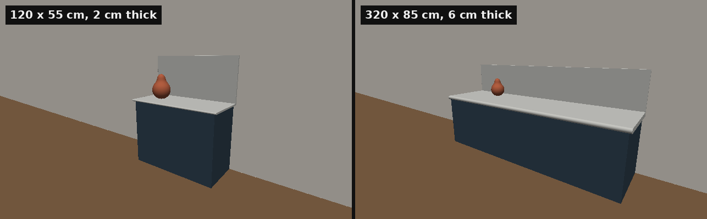
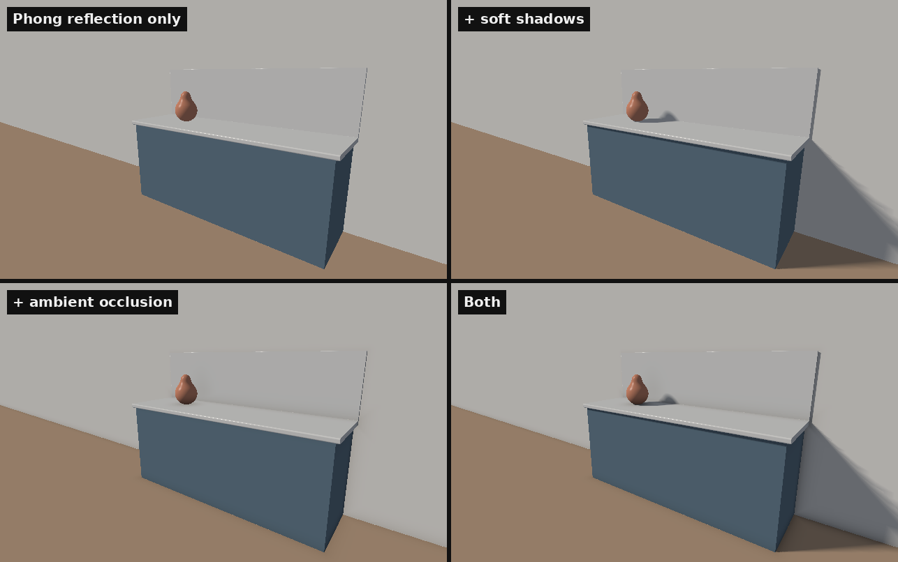
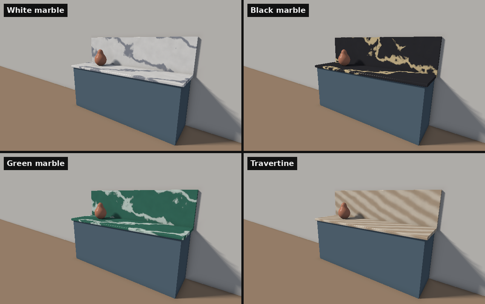
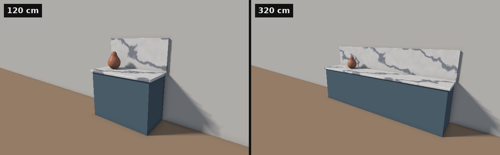

# Stone Previewer - Project Report

**Idea.** Customers choosing a stone countertop have to decide on an edge profile and a finish, and it
is hard to imagine either from a small sample. This app shows the countertop in a room and lets the
customer switch the stone, the edge and the finish, and move the light from morning to evening.

**Technique.** The homework engine is a rasterizer: it loads a triangle mesh, projects it, fills the
triangles and lights them locally. This project uses the opposite approach. There is no mesh. The scene
is a mathematical function, and each pixel shoots a ray into it (ray marching). That makes rounded
edges, soft shadows and reflections cheap, which are exactly the things this app needs to show.

## Part 1: Ray Marching a Sphere

### Approach

- The app draws a single triangle that covers the whole screen, so the fragment shader runs once for
  every pixel. All the work happens in that shader.
- The scene is described by a **signed distance function** (SDF), `map(p)`: for any point `p` it returns
  the distance to the nearest surface (positive outside, negative inside). For a sphere of radius `r`
  centred on the origin this is simply `length(p) - r`.
- For each pixel I build a ray from the camera through that pixel and **march** along it: at every
  point the SDF says how far the nearest surface is, so the ray can safely step exactly that far
  without passing through anything. The loop stops when the distance is below a small epsilon (hit) or
  the ray has gone too far (miss).
- The surface normal is the gradient of the SDF, which I estimate with central differences
  (six extra calls to `map`). In the homework the normal came from the cross product of triangle edges;
  here there are no triangles to take it from.
- To check the result, the normal is shown directly as a color: `color = 0.5 * normal + 0.5`.

### Result

The sphere is smooth at any zoom level because it is evaluated per pixel, not approximated by polygons.
The colors confirm the normals: right is red (+x), up is green (+y), and facing the camera is blue (+z).

## Part 2: Building the Room from Distance Functions

### Approach

- I added a second primitive, the box (`sdBox`), next to the sphere. Planes are even simpler: the floor
  is `p.y` and the wall is `p.z - WALL_Z`.
- The scene function `map(p)` now combines several shapes. The **union** of two shapes is the minimum
  of their distances, so the room is built by taking the closest of: floor, wall, cabinet, countertop
  slab, backsplash and a vase. All sizes are in metres (the cabinet is 0.86 m high, the slab 4 cm thick
  with a 3 cm overhang), so the proportions are those of a real kitchen unit.
- `map` returns two values: the distance and a **material id** of the closest shape. The ray marcher
  passes the id on, and the shader picks a color from it. This replaces the per-face material of a mesh.
- The vase is two spheres joined with a **smooth minimum** instead of `min`. It blends the two surfaces
  over a small distance, so they melt into one shape with no crease. With a mesh this would need
  remodelling; here it is one line.
- The camera is no longer fixed on the z axis. `cameraRay` builds a forward / right / up frame from an
  eye position and a target, the same idea as the view matrix in the homework, but used to aim rays
  instead of transforming vertices.
- The shading is still temporary: one fixed light direction plus a constant ambient term, only so the
  shapes can be told apart. There are no shadows yet, which is why the scene looks flat.

### Result

The whole room is about 30 lines of distance functions and contains no triangles. Note the vase: its
body and neck join smoothly.

## Part 3: Edge Profiles

### Approach

- This is the first feature the customer actually uses: choosing between a **square**, **bevelled**,
  **rounded** and **bullnose** edge.
- I design the edge in 2D, as the cross-section of the slab seen from the side, and then extrude that
  shape along the length of the countertop. The countertop is no longer `sdBox` but its own function,
  `sdSlab`.
- All the profiles come from one formula, the 2D rounded rectangle, by changing a single number, the
  corner radius: 0 gives the square edge, 10 mm gives the rounded edge, and half the slab thickness
  turns the front into a half circle, which is the bullnose.
- The bevelled edge uses the **intersection** of two shapes, which for distance functions is
  `max(a, b)`: the square profile intersected with a 45 degree plane that cuts 14 mm off the top front
  corner.
- The extrusion is also an intersection: the 2D profile (which is infinitely long in x) is cut to the
  slab's width and at the wall with `max`.
- The choice is sent to the shader as a uniform, `uEdge`, from a small control panel
  ([lil-gui](https://lil-gui.georgealways.com), open source). I also added a second camera position,
  a close-up of the front corner, where the profile is visible in cross-section.

### Result

Switching the edge changes one number in a formula, and the picture updates immediately. On a triangle
mesh, each of these would be a separately modelled object, and the round ones would need many small
polygons to look smooth.

**Limitation:** only the front edge is profiled. The two side ends of the slab stay square, and the
round profiles are rounded on the bottom as well as the top.

## Part 4: Adjustable Countertop Size

### Approach

- Every kitchen is a different size, so the length, depth and thickness of the countertop are now
  sliders (in centimetres) instead of constants.
- In the shader the three constants became uniforms: `uLength`, `uDepth`, `uThickness`. Everything
  else is derived from them inside `map`: the cabinet is the slab minus the overhang, the backsplash
  has the slab's length and thickness (its own edges stay square), and the vase stays at the same relative position on the top.
- The edge profile adapts by itself. The bullnose radius is defined as half the thickness, so a
  thicker slab automatically gets a bigger half circle, and the rounded edge is clamped so its radius
  can never be larger than half the thickness.
- Both cameras follow the size: the overview steps back for a longer countertop, and the close-up is
  defined relative to the front corner of the slab, so it stays on the edge.
- Resizing does not rebuild anything. There is no vertex buffer to regenerate, only three numbers
  that the distance function reads, so the change is immediate.

### Result

The same scene at two sizes. The proportions of the cabinet, backsplash and edge all follow the three
sliders.

This matters for the stone texture added later: because the texture will be computed from the 3D
position of each point, a longer countertop will show *more* stone, not a stretched picture of it.

## Part 5: Lighting, Soft Shadows and Ambient Occlusion

### Approach

- I replaced the temporary shading with the **Phong reflection model** from the lecture, using the
  same notation: `I = Ia + Id + Is`, with `Ia = La * ka`, `Id = kd * (l . n) * Ld` and
  `Is = ks * (r . v)^alpha * Ls`. There is one parallel light source, like sun through a window.
- Each material now has its own `k`, `ks` and `alpha` (a `Material` struct in `materials.glsl`), so the
  stone and the vase get a highlight while the wall stays matte.
- Because the normal comes from the distance function at every pixel, this is automatically per-pixel
  (Phong) shading. There are no vertices to interpolate between, so there is no flat / Gouraud / Phong
  choice to make as there was in the homework.
- **Soft shadows.** The homework engine had no shadows, because a rasterizer only knows about the
  triangle it is drawing. Here I march a second ray from the surface point towards the light. If it
  hits something, the point is in shadow. If it only passes *close* to something, the point is in the
  penumbra, and I darken it by how close the miss was (`sharpness * h / t`). This gives a soft edge
  that gets wider further from the object, at no extra cost over a hard shadow.
- **Ambient occlusion.** I sample the distance function at five short steps along the normal. In open
  space the distance there equals the step length. If it is smaller, another surface is nearby and
  blocks part of the ambient light, so I reduce the ambient term. This darkens the corners where the
  cabinet meets the floor and the wall.
- The shadow multiplies only the diffuse and specular terms (direct light), and the occlusion only the
  ambient term (light from everywhere). Both can be switched off in the control panel to compare.
- The final color is clamped ("beware of overflows") and gamma-corrected.

### Result

The same view with the two effects switched on and off. With the reflection model alone, the cabinet
looks like it floats in front of the wall. The shadow places it in the room and shows where the light
comes from, and the ambient occlusion grounds it where it meets the floor and the wall.

## Part 6: Procedural Stone

### Approach

- The stone is a **procedural texture** built from the functions in the Procedural Textures lecture,
  keeping the names from the slides: `Noise`, `FBm`, `turbulence`, `marble` and `marble_color`.
- `Noise` is classic 3D Perlin (gradient) noise: a pseudo-random gradient at every grid point, taken
  from a hash function instead of a stored table, and Hermite interpolation between the 8 nearest
  grid points.
- `FBm` sums several octaves of the noise, each with double the frequency and half the amplitude.
  `turbulence` is the same sum but of the absolute value of the noise, which creates sharp creases.
- The marble follows the lecture: `x = p.x + turbulence(p)` and `color = marble_color(sin(x))`.
  `sin` alone gives straight parallel stripes, and the turbulence bends them into veins. I changed two
  things: the stripes run along a diagonal direction so the veins cross the countertop at an angle,
  and the palette uses a narrow `smoothstep`, so most of the surface is the base color with thin veins.
- There are four stones (white, black and green marble, and travertine). Each is only five numbers:
  vein color, base color, vein frequency, turbulence amount and vein width. Travertine uses a high
  frequency with little turbulence, which gives its straight bands.
- A **slab number** slider shifts the point before it is textured, which is like cutting the slab
  from a different place in the quarry: the same stone, with a different vein pattern.
- The texture is evaluated on the 3D position of the surface point, in metres. There are no UV
  coordinates and no image.

### Result

Two things follow from the texture being a function of the 3D point:

- **It cannot stretch.** Below is the same white marble on a 120 cm and a 320 cm countertop. The veins
  keep their size, and the longer piece simply shows more of the stone. An image texture mapped onto
  a mesh would have to be stretched or tiled.
- **It is continuous across pieces.** The veins run from the countertop up into the backsplash without
  a seam, as if both were carved from one block.

**Limitation:** this is a generic stone *type*, not a photograph of a specific slab, and real veins
are less regular than the ones this function produces.
