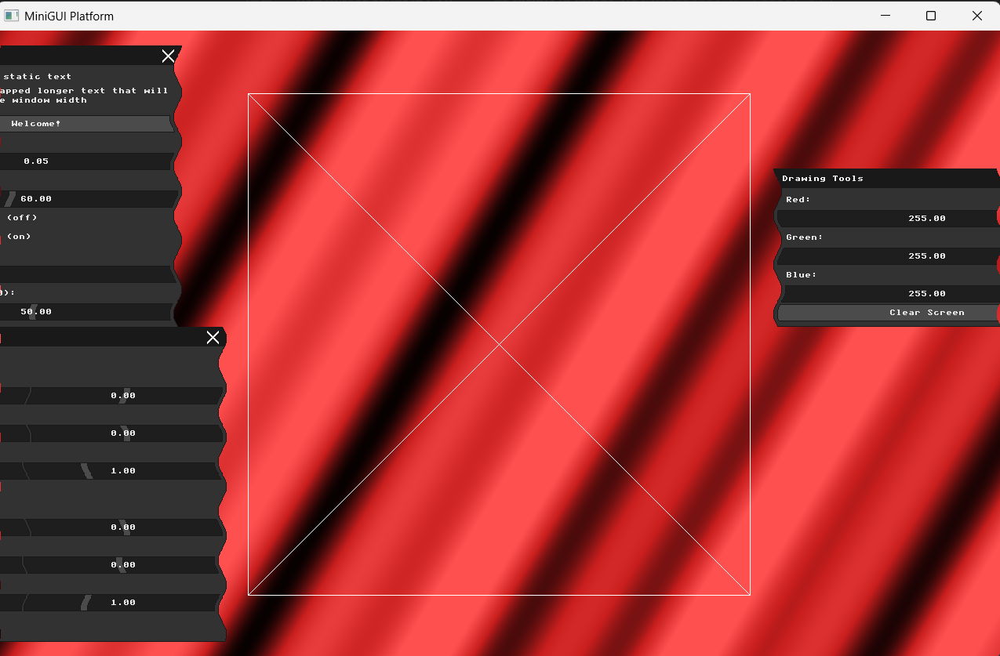
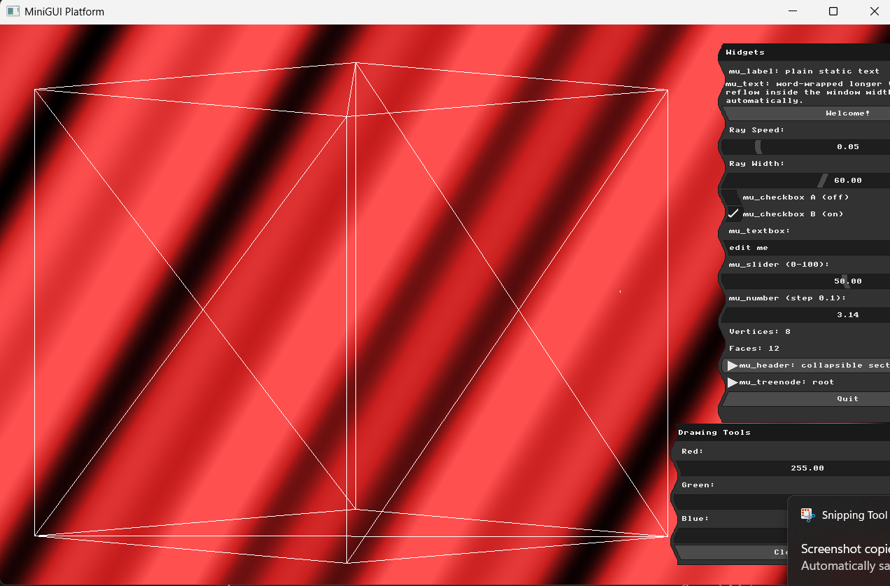
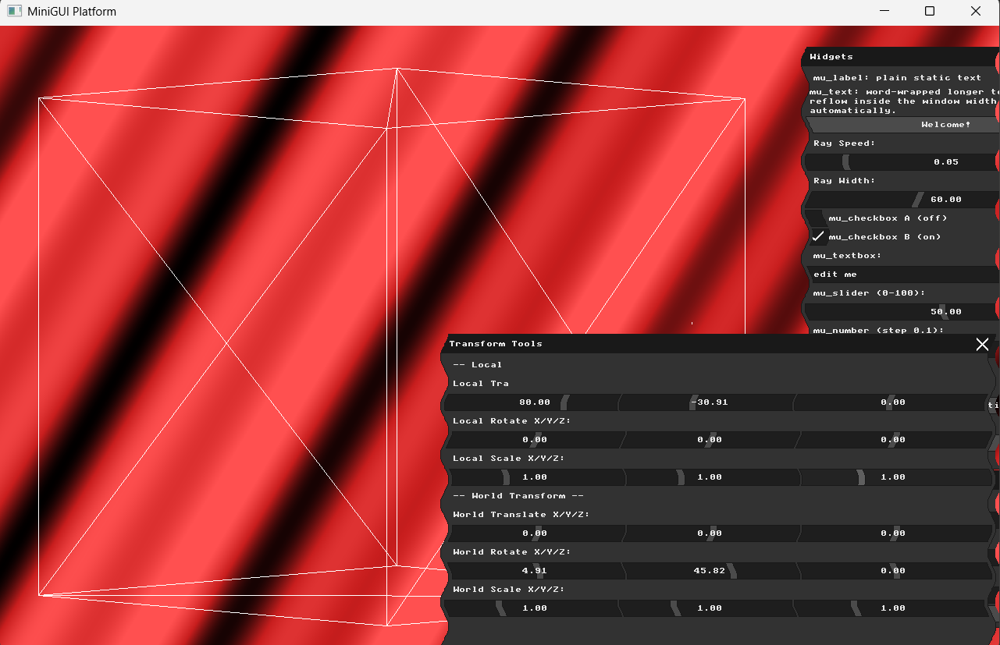
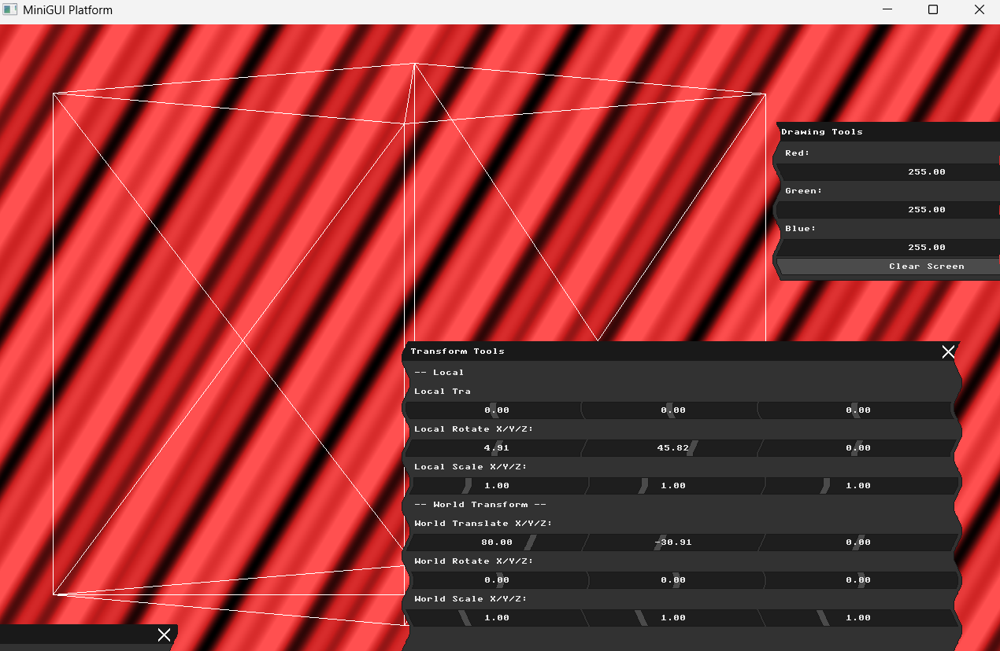
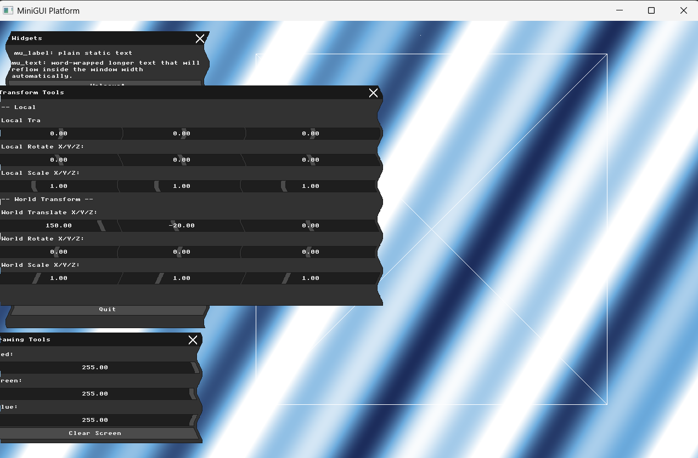

# Assignment: Wireframe Viewer and Geometric Transformations

## Overview

In this assignment, you will transition from drawing 2D pixels to manipulating 3D geometry. You will load a 3D mesh into memory, project its vertices onto your 2D screen, and draw it using the line-drawing algorithm you built in Assignment 1. Finally, you will implement mathematical transformations (scaling, rotation, and translation) and wire them up to your Immediate Mode GUI to manipulate the 3D object in real-time.

### Part 0: Introduction to GLM

In computer graphics, manipulating 3D objects requires a lot of linear algebra, specifically vectors and matrices. Writing your own math library from scratch can be tedious and prone to errors. Instead, the industry standard for OpenGL and similar graphics applications is **GLM** (OpenGL Mathematics). GLM is a header-only C++ mathematics library based on the OpenGL Shading Language (GLSL) specifications, making it incredibly useful for transformations and vector math.

##### Task

Before proceeding to 3D transformations, you need to integrate GLM into your project. Ask an AI assistant to help you set this up. We recommend using a prompt similar to this:
*"Update cmake to fetch GLM and include it in the code, and add a small example in main that demonstrates how it works."*

Verify that the project successfully configures, compiles, and the small GLM example runs without errors.

### Part 1: Loading and Inspecting 3D Data

In computer graphics, 3D objects are typically represented as a **polygon mesh**. A mesh consists of two primary lists of data:

1. **Vertices:** A list of 3D points $(x, y, z)$ in space.

2. **Faces (or Polygons):** A list of indices that connect the vertices together. In our case, every face is a triangle connecting exactly three vertices.

Before we can draw anything, we must parse a 3D model file from the hard drive and store its vertices and faces in memory (usually in structures like `std::vector<Vector3>` and `std::vector<Face>`).

##### Task

Write a function that loads an `.obj` file. To check your code, create an `.obj` file that contains an object with up to 10 vertices and faces, load it, and display the number of faces and vertices in the GUI and see if it matches the content of the file. You may display more information as seem necessary.

### Part 2: Normalization and the Viewport Transform

When you load a mesh, its vertex coordinates are completely arbitrary. A model of an ant might have coordinates ranging from $-0.01$ to $0.01$, while a model of a city block might range from $-5000$ to $5000$, but it could also be the opposite. There are no guarantees.

If you try to draw these raw coordinates directly to your framebuffer (which likely ranges from $0$ to $1000$ pixels), the whole object might be contained in a single pixel, or be entirely off-screen. To fix this, we must apply a *temporary* debugging transformation to scale and center the object so it fits nicely inside our window.

##### Task

Write an algorithm to find the bounding box of your loaded mesh (the minimum and maximum $x$, $y$, and $z$ values). Using this information, calculate a uniform scale factor and a translation vector to map the model's vertices so that they fit comfortably within your window's dimensions (e.g., scaling them up/down to around $0-1000$ and centering them). In your report, write a brief explanation of the mathematical logic you used to calculate this specific bounding-box-to-window transformation.

### Part 3: Orthographic Projection and Wireframe Rendering

Our screen is a 2D grid of pixels, but our mesh exists in 3D space. To draw it, we must mathematically flatten the 3D vertices into 2D points.

The simplest way to do this is an **Orthographic Projection**, which essentially ignores depth. To orthographically project a point $(x, y, z)$ straight onto the 2D plane of your monitor, you simply drop the $z$-coordinate and use $(x, y)$ to draw to the screen.

##### Task

Iterate over all the faces (triangles) in the mesh. For each triangle, retrieve its three 3D vertices, drop one of the coordinates (typically $z$) to project them into 2D, and draw the three connecting edges using the `draw_line` function you wrote in Assignment 1. You should now see a static wireframe model clearly displayed on your screen! Place a screenshot of your rendered wireframe model in your report.

### Part 4: Transformation Matrices & Immediate Mode GUI

To move, rotate, or scale a 3D object, we multiply its vertices by $4 \times 4$ transformation matrices. A complex movement is achieved by creating separate basic matrices for Scale ($S$), Rotation ($R$), and Translation ($T$), and multiplying them together into a single Model Matrix ($M$).

Furthermore, transformations can occur in different "frames of reference." You can transform an object relative to its own center (**Local Transformations**) or relative to the center of the universe (**World Transformations**).

##### Task

In your rendering loop, add new GUI widgets (such as sliders or input boxes) to control the $X, Y, Z$ parameters for both Local and World transformations. You should have separate UI controls for:

* Local Translation, Local Rotation, Local Scale

* World Translation, World Rotation, World Scale

Take a screenshot of the GUI layout you designed and include it in your report.

### Part 5: Applying Transformations

In linear algebra, matrix multiplication is not commutative ($A \cdot B \neq B \cdot A$). The order in which you apply transformations drastically changes the visual result.

If you *Translate then Rotate*, the object moves to a new position and then revolves around the origin like a planet orbiting the sun. If you *Rotate then Translate*, the object spins in place like a top, and is then moved to its new position. This distinction is the core difference between World and Local frame transformations.

##### Task

Compute the final transformation matrices based on your UI slider values, and apply them (by multiplying) to your mesh's vertices *before* you perform the orthographic projection and draw the lines. Verify that the model transforms interactively as you move the sliders. Show two screenshots in your report comparing the difference between:

1. Translating in the model (local) frame and then rotating in the world frame.

2. Translating in the world frame and then rotating in the local (model) frame.

### Part 6: Interactive Input Modifiers

While GUI sliders are excellent for precise control, modern 3D applications allow users to interact with the scene directly using the mouse or keyboard. By intercepting input events before they reach the UI, we can increment or decrement our transformation state variables dynamically.

##### Task

Implement one approach for modifying the basic transformations using direct keyboard or mouse input. For example, you might map the arrow keys to World Translation, or map holding the left mouse button and dragging to Local Rotation. Describe your chosen input method and how it modifies the transformation state in your report.

### Part 7: Pair Programming Extensions

*Students working in pairs are required to complete the following extensions.*

##### 1. Multiple Model Management (Scene Graph Basics)

A real scene contains more than one object. To manage this, an application needs a way to store multiple meshes and maintain independent transformation states (position, rotation, scale) for each one.

* **Task:** Allow loading and storing multiple different `.obj` models simultaneously. Add a UI element (like a dropdown or a list of radio buttons) to select the "Active Model." Ensure that your Transformation GUI and keyboard/mouse inputs only affect the currently active model, allowing you to compose a scene with multiple objects placed independently. Demonstrate the result of placing multiple independent models in a single screenshot in your report.

##### 2. Advanced Mouse Control

Object manipulation usually requires combining multiple mouse inputs to handle different types of transformations intuitively.

* **Task:** Implement a *second* approach for modifying transformations using the mouse (so you have two total, fulfilling the "two approaches" requirement for pairs). For example, if you mapped mouse-dragging to rotation in Part 6, map the mouse scroll wheel to uniformly scale the active object, or map right-click-dragging to translation. Describe both implementations in your report.


---

# My Report

**Student:** Mohammad Abu Saleh  
**ID:** 206380487

---

## Part 0: Introduction to GLM

### Approach
Integrated GLM via CMake's `FetchContent`, pulling version 1.0.1 directly from the official GLM GitHub repo. Linked it to the executable using `glm::glm` in `target_link_libraries`.

To verify the integration, added a small example in `main()` that creates an identity `glm::mat4`, applies a `glm::translate`, and prints the resulting position to the console.

```cpp
glm::vec3 position(1.0f, 2.0f, 3.0f);
glm::mat4 model = glm::mat4(1.0f);
model = glm::translate(model, position);
printf("GLM works! Translated position: (%.1f, %.1f, %.1f)\n", model[3][0], model[3][1], model[3][2]);
```

Verified output: `GLM works! Translated position: (1.0, 2.0, 3.0)`

---

## Part 1: Loading and Inspecting 3D Data

### Approach
Wrote a simple `.obj` parser (`load_obj`) that reads a file line by line:
- Lines starting with `v` are parsed as vertices (x, y, z) and stored in `std::vector<Vec3>`
- Lines starting with `f` are parsed as triangle faces, taking only the vertex index before the `/` (ignoring texture/normal indices), and stored in `std::vector<Face>`

### Test Model
Created a simple cube in Blender (8 vertices, 12 triangulated faces) and exported it as `cube.obj` with "Triangulate Faces" enabled.

The loaded counts are displayed live in the MicroUI Widgets panel:
```cpp
snprintf(mesh_info, sizeof(mesh_info), "Vertices: %d", (int)mesh_verts.size());
mu_label(ctx, mesh_info);
snprintf(mesh_info, sizeof(mesh_info), "Faces: %d", (int)mesh_faces.size());
mu_label(ctx, mesh_info);
```

Confirmed: `Vertices: 8`, `Faces: 12` — matches the cube exactly.

---

## Part 2: Normalization and the Viewport Transform

### Approach
Wrote `normalize_mesh()` to remap arbitrary mesh coordinates into the window's pixel space:

1. **Find the bounding box** — loop through all vertices, tracking min/max for x, y, z independently.
2. **Find the center** — average of min and max for each axis: `cx = (min_x + max_x) / 2`, similarly for y and z.
3. **Find the largest dimension** — `max_range = max(range_x, range_y, range_z)`. Using a single uniform scale factor (rather than separate x/y/z scales) keeps the object's proportions correct and avoids distortion.
4. **Compute scale** — scale the largest dimension to 80% of the smaller window dimension: `scale = (min(width, height) * 0.8) / max_range`.
5. **Remap each vertex** — subtract the center (to move the object to the origin), multiply by scale, then add half the window size (to center it on screen): `n.x = (v.x - cx) * scale + width / 2`.

This guarantees that regardless of the original coordinate range of the model (whether tiny like an ant or huge like a building), it always fits comfortably and centered within the window.

---

## Part 3: Orthographic Projection and Wireframe Rendering

### Approach
For each triangle face, retrieved its 3 vertices, dropped the z-coordinate (orthographic projection), and drew the 3 connecting edges using the `draw_line` function (Bresenham's algorithm) from HW1.

```cpp
for (const auto& face : mesh_faces) {
    Vec3 v0 = norm_verts[face.v0];
    Vec3 v1 = norm_verts[face.v1];
    Vec3 v2 = norm_verts[face.v2];
    draw_line((int)v0.x, (int)v0.y, (int)v1.x, (int)v1.y, MFB_RGB(255,255,255));
    draw_line((int)v1.x, (int)v1.y, (int)v2.x, (int)v2.y, MFB_RGB(255,255,255));
    draw_line((int)v2.x, (int)v2.y, (int)v0.x, (int)v0.y, MFB_RGB(255,255,255));
}
```

Viewed straight-on (no rotation), the cube's front and back faces project to nearly the same square, with the diagonal lines visible from each face's triangulation split.

### Result


---

## Part 4: Transformation Matrices & Immediate Mode GUI

### Approach
Added a new "Transform Tools" UI window with 6 groups of 3 sliders each (X, Y, Z), covering:
- Local Translation, Local Rotation, Local Scale
- World Translation, World Rotation, World Scale

Each group uses `mu_layout_row(ctx, 3, w3, 0)` to lay out 3 sliders side by side, bound directly to `glm::vec3` global variables via pointer (`&local_translation.x`, etc).

One bug encountered: using `{-1, -1, -1}` as column widths caused the 3 sliders to collapse into a single overlapping widget. Fixed by using explicit pixel widths instead: `{220, 220, -1}`.

### Result


---

## Part 5: Applying Transformations

### Approach
Built `apply_transforms()` which constructs two separate 4x4 matrices using GLM:

- **Local matrix**: translate → rotate (X, Y, Z) → scale, applied first (around the object's own center)
- **World matrix**: translate → rotate (X, Y, Z) → scale, applied second (around the world origin)

```cpp
glm::vec4 result = world * local * p;
```

Since matrix multiplication is not commutative, applying local first then world produces a different result than the reverse order — this is the core distinction between the two frames of reference.

### Comparison 1: Local Translate + World Rotate
Local Translate X = 80, World Rotate Y ≈ 45. The cube moves from its own center first, then the entire result (including the offset) revolves around the world origin — like a planet orbiting the sun.



### Comparison 2: World Translate + Local Rotate
World Translate X = 80, Local Rotate Y ≈ 45. The cube spins in place around its own center first, then the whole spun result is shifted to its new position — like a top spinning then sliding.



Even with similar magnitude values, the visual results are clearly different, demonstrating the non-commutative nature of matrix transforms and the practical difference between local and world frames.

---

## Part 6: Interactive Input Modifiers

### Approach
Used `mfb_set_keyboard_callback` to intercept arrow key presses and directly modify `world_translation`:

```cpp
mfb_set_keyboard_callback(
    [](struct mfb_window *w, mfb_key key, mfb_key_mod mod, bool isPressed) {
        if (!isPressed) return;
        const float step = 10.0f;
        if (key == KB_KEY_RIGHT) world_translation.x += step;
        else if (key == KB_KEY_LEFT) world_translation.x -= step;
        else if (key == KB_KEY_UP) world_translation.y -= step;
        else if (key == KB_KEY_DOWN) world_translation.y += step;
    },
    window);
```

Each arrow key press increments or decrements the relevant axis of `world_translation` by a fixed step (10 units). Since `apply_transforms()` reads this variable every frame, the cube updates its position immediately and interactively as the user holds/presses arrow keys, in addition to the existing slider controls.

### Result
