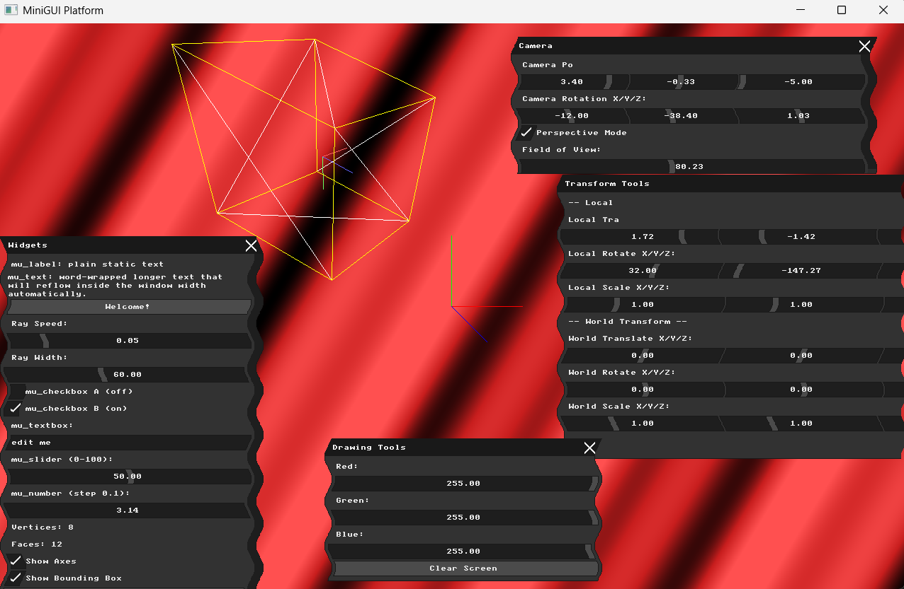
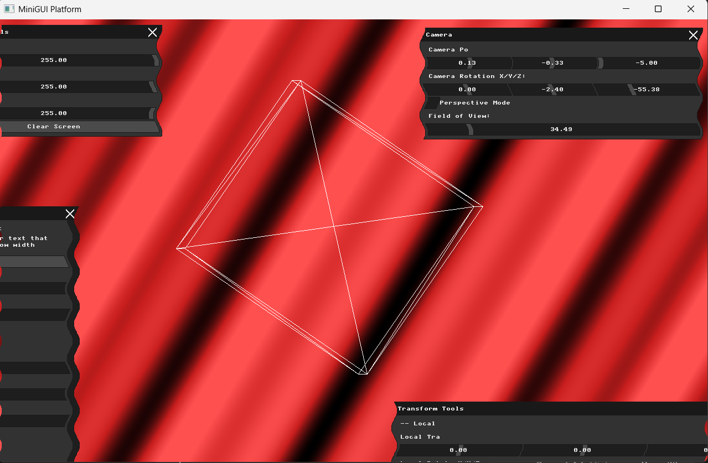
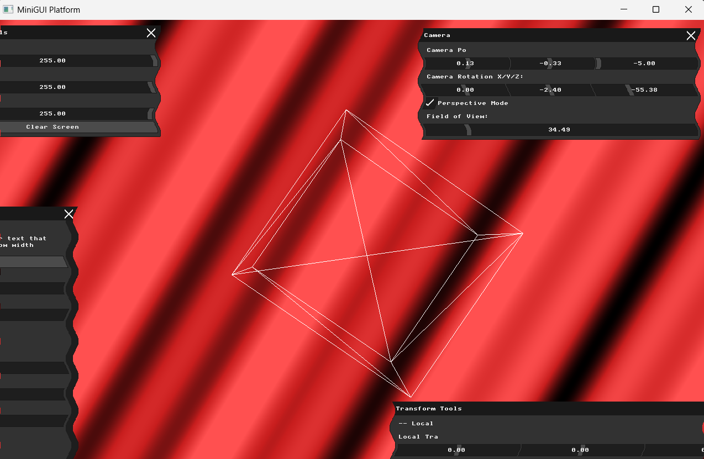
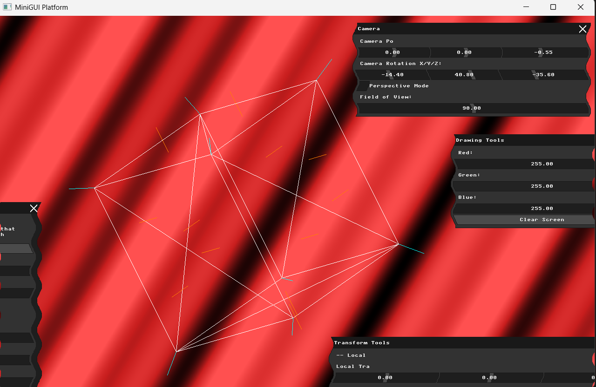

# Assignment: Virtual Cameras and Projections

## Overview

In Assignment 2, you successfully loaded a 3D model, applied mathematical transformations, and orthographically flattened it to the screen. In this assignment, we will implement a proper virtual camera system. You will explore the View matrix, replace your basic orthographic projection with a true Perspective projection, and calculate geometric normals to prepare our models for lighting.

### Part 1: Coordinate Frames and Bounding Boxes

##### Background: Visualizing Space

When manipulating 3D objects, it is incredibly easy to lose track of where the object actually is versus where its local center is. When you translate an object in the "world" frame, its local axes move with it. When you rotate it in the "local" frame, its axes spin. To debug complex transformations, graphics programmers draw helper geometry (like bounding boxes and coordinate axes) to visualize these invisible mathematical spaces.

##### Task

Implement two visual debugging features in your renderer, and add UI checkboxes to toggle them on and off:

1. **Coordinate Axes:** Draw short, colored lines (e.g., Red for X, Green for Y, Blue for Z) originating from the center of the model to represent its Local axes, and a fixed set of axes at `(0,0,0)` to represent the World axes.

2. **Bounding Box:** Calculate the 8 corners of the object's 3D bounding box. Draw the wireframe of this box.
   *Test your implementation:* Transform your model. If you transform in the model frame, the model's axes should remain fixed relative to the model. If you transform in the world frame, the model's axes should transform alongside it!

### Part 2: The Virtual Camera (View Matrix)

##### Background: The Camera Illusion

In computer graphics, a "camera" doesn't actually exist. To create the illusion of a camera moving forward into a scene, we actually move the entire 3D universe backward. This inverse transformation is called the **View Matrix**.

If a camera is positioned at $(C_x, C_y, C_z)$ and rotated by some angle, the View matrix applies the exact *opposite* translation and rotation to every vertex in the scene, effectively bringing the entire world into the camera's local coordinate space.

##### Task

Create a `Camera` object or struct. Give it position and rotation properties. Add UI sliders to control the camera's position and rotation in the world.
Construct the View matrix from these parameters (remembering to invert the transformation!) and multiply your model's vertices by this View matrix *after* the Model matrix but *before* the Projection matrix ($P \cdot V \cdot M \cdot v$). Verify that moving the camera left shifts the object to the right on your screen.

### Part 3: Perspective Projection

##### Background: The View Frustum and Perspective Divide

Orthographic projection (dropping the Z coordinate) makes architectural drafting easy, but it lacks depth—objects far away look the same size as objects close up.

A **Perspective Projection** maps a 3D truncated pyramid (the *frustum*) into a standardized 3D cube (Normalized Device Coordinates). It achieves the illusion of depth through the **Perspective Divide**: dividing the $X$ and $Y$ coordinates by the vertex's distance from the camera ($Z$ or $W$ in homogeneous coordinates). The further away a vertex is, the more its $X$ and $Y$ values are squashed toward the center of the screen.

##### Task

Use GLM (or derive the math yourself) to construct a Perspective Projection matrix. You will need to define a Field of View (FOV), an aspect ratio (based on your window size), and Near/Far clipping planes. Replace your orthographic projection with this new matrix. Add a UI button to toggle between Orthographic and Perspective modes. Load a mesh, move the camera away from it, and ensure the difference between the two projections is clearly visible.

### Part 4: Calculating Normals

##### Background: Which way is up?

To eventually calculate how light hits our object, we need to know which direction every polygon is facing. This direction is represented by a 3D unit vector called a **Normal**.

* A **Face Normal** is a single vector pointing perpendicular to the surface of a triangle.

* A **Vertex Normal** is a vector assigned to a vertex, usually calculated by averaging the face normals of all triangles sharing that vertex. This allows for smooth shading across jagged geometry.

##### Task

Write an algorithm to compute both the Face Normals and Vertex Normals for your loaded mesh. Use the cross product of the triangle's edges to find the face normal.
To verify your math is correct, implement a "Draw Normals" debug toggle in your UI. When enabled, use your `draw_line` function to draw short line segments pointing outward from the center of each face (for face normals) and from each vertex (for vertex normals). Make sure they transform correctly when you rotate the model!

### Part 5: Pair Programming Extensions

*Students working in pairs are required to complete the following extensions.*

##### 1. The "LookAt" Transformation

* **Background:** Manually adjusting camera rotations with sliders to look at an object is difficult. The `LookAt` function mathematically constructs a View matrix based on three vectors: the camera's *Position*, a *Target* point to look at, and an *Up* vector defining the camera's roll.

* **Task:** Implement a `LookAt` camera mode. Add UI input fields for a Target Coordinate $(X, Y, Z)$. Calculate the View matrix so that the camera always points perfectly at the target, regardless of where the camera is positioned.

##### 2. The Dolly Zoom (Vertigo Effect)

* **Background:** Made famous by Alfred Hitchcock, a Dolly Zoom occurs when a camera physically moves away from a subject while simultaneously zooming in (changing the Field of View) to keep the subject the exact same size on screen. This distorts the background perspective dramatically.

* **Task:** Add a single "Dolly Zoom" slider to your UI. As you drag the slider, mathematically link the camera's Z-position and the Perspective Projection's FOV so the active model remains visually stationary while the perspective distortion shifts wildly.

---

# My Report

**Student:** Mohammad Abu Saleh  
**ID:** 206380487

---

## Part 1: Coordinate Frames and Bounding Boxes

### Approach

Added two debug visualization features controlled by UI checkboxes in the Widgets panel.

**Coordinate Axes:**
- World axes are drawn as fixed colored lines from the screen center — red for X, green for Y, blue for Z. These never move regardless of any model transforms, representing the absolute world coordinate system.
- Local axes are drawn from the model's origin `(0,0,0)` in model space, projected through the full `apply_transforms` pipeline (local → world → view → projection). They rotate and move with the model when local transforms are applied, but stay fixed relative to the model when world transforms are applied.

**Bounding Box:**
- Computed min/max bounds across all vertices in original model space.
- Projected all 8 corners of the bounding box through `apply_transforms` so the yellow wireframe box always correctly wraps the transformed mesh.
- Drawn using 12 edges (4 bottom, 4 top, 4 vertical connections).

### Result


---

## Part 2: The Virtual Camera (View Matrix)

### Approach

Added `cam_position` and `cam_rotation` as `glm::vec3` globals representing the camera in world space. The View matrix is constructed as the inverse of the camera's transform — rotating first (negated angles), then translating (negated position):

```cpp
glm::mat4 view = glm::mat4(1.0f);
view = glm::rotate(view, glm::radians(-cam_rotation.x), glm::vec3(1, 0, 0));
view = glm::rotate(view, glm::radians(-cam_rotation.y), glm::vec3(0, 1, 0));
view = glm::rotate(view, glm::radians(-cam_rotation.z), glm::vec3(0, 0, 1));
view = glm::translate(view, -cam_position);
```

The full vertex pipeline is: `view * world * local * vertex`

Added a Camera UI window with sliders for position (±5 units) and rotation (±180°). Verified correct behavior: moving the camera right shifts the scene left on screen — the correct "camera illusion" described in the background.

### Result


---

## Part 3: Perspective Projection

### Approach

Used `glm::perspective` to construct a perspective projection matrix with a configurable FOV, aspect ratio based on window dimensions, and near/far clipping planes. After the view transform, vertices are multiplied by the projection matrix, then perspective-divided (x/y divided by w), and finally mapped from NDC (-1 to 1) to screen pixels.

Added a UI checkbox to toggle between orthographic and perspective modes, and a FOV slider (10° to 170°). In orthographic mode, a fixed scale maps world units directly to pixels with no depth distortion. In perspective mode, the camera must be at a negative Z position to correctly view the scene — objects further from the camera appear smaller.

### Orthographic Result


### Perspective Result


---

## Part 4: Calculating Normals

### Approach

**Face Normals:** For each triangle, computed the cross product of its two edge vectors to get a vector perpendicular to the surface, then normalized it:

```cpp
glm::vec3 a(v1.x-v0.x, v1.y-v0.y, v1.z-v0.z);
glm::vec3 b(v2.x-v0.x, v2.y-v0.y, v2.z-v0.z);
glm::vec3 n = glm::normalize(glm::cross(a, b));
```

Each face normal is drawn as an orange line from the triangle's center point outward in model space, then projected through the full pipeline so it correctly follows the model when rotated.

**Vertex Normals:** For each vertex, accumulated the face normals of all triangles sharing that vertex, then normalized the sum. This produces a smooth averaged normal. Each vertex normal is drawn as a cyan line from the vertex position outward.

Since the cube is triangulated (12 triangles from 6 square faces), there are 2 face normals per square face. Since the two triangles on each flat face are coplanar, their normals point in the same direction.

### Result
