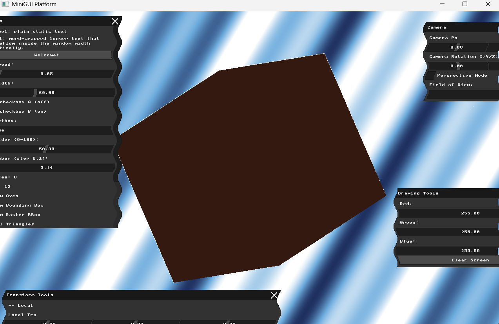
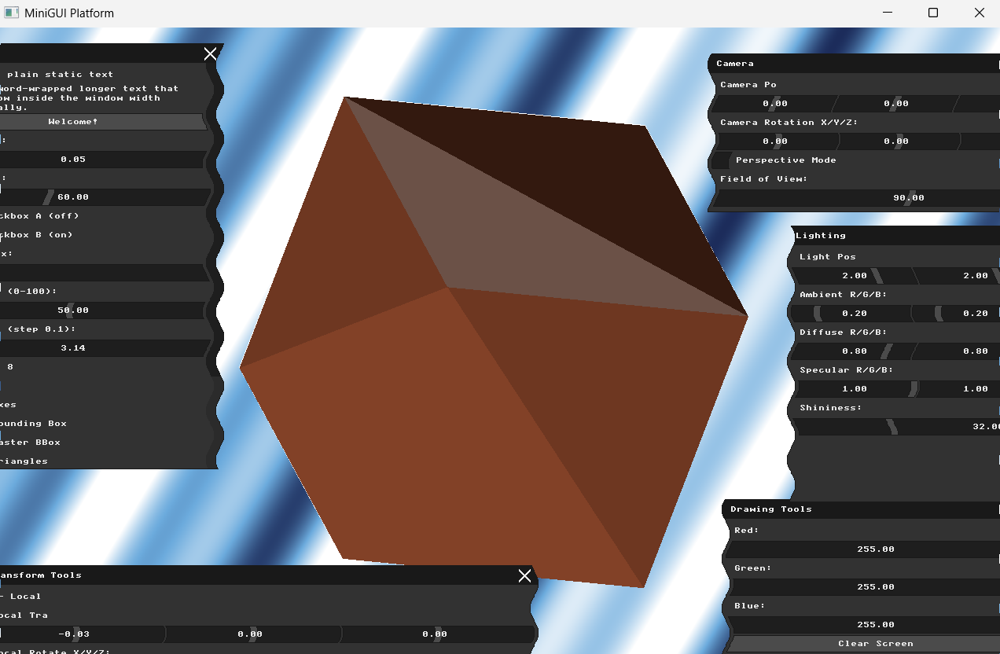
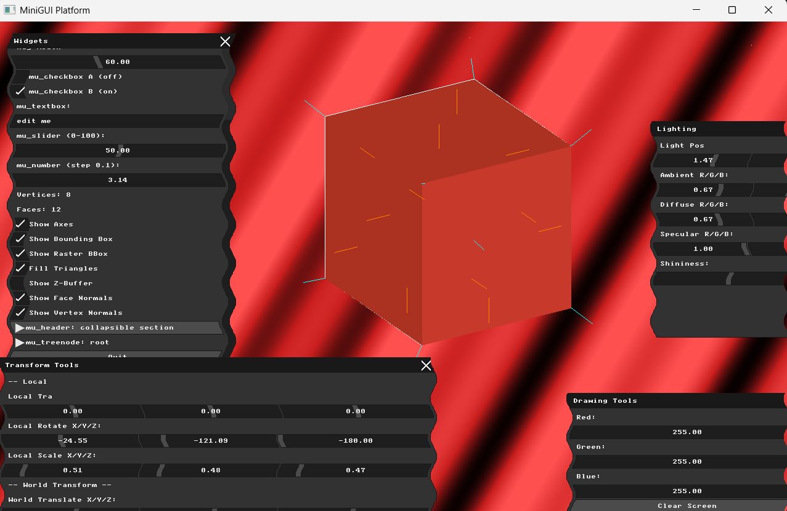
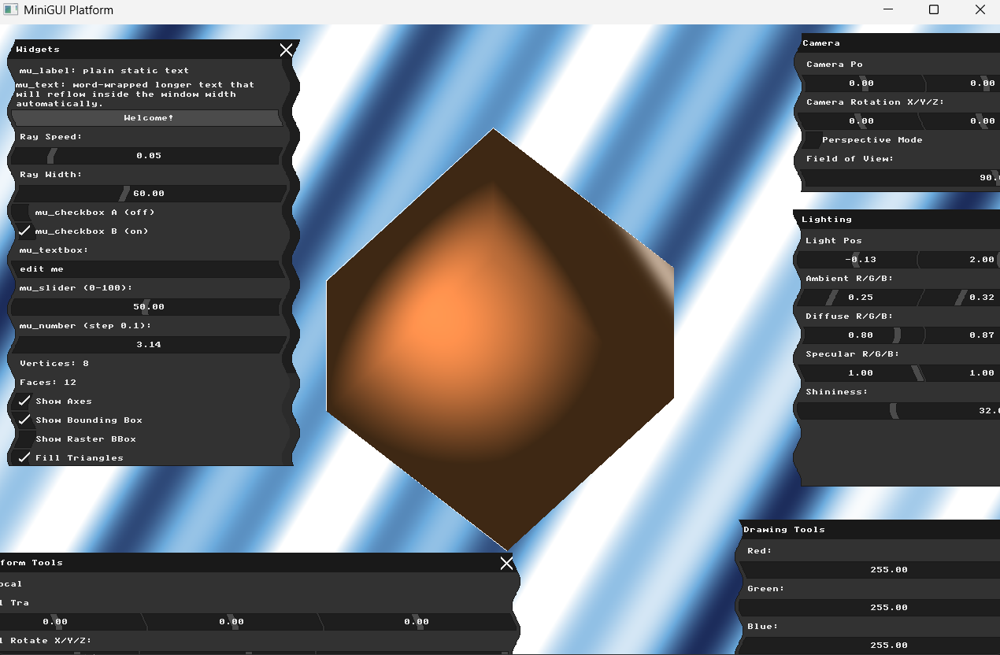

# Assignment: Lighting, Materials, and Shading

## Overview

Our solid models currently look flat and artificial. In the real world, our perception of 3D shape comes from how light interacts with surfaces. In this final assignment, you will implement the classic **Phong Reflection Model**, calculate the interaction between virtual lights and surface normals, and use interpolation to create smooth, realistic shading.

### Part 1: Light Sources and Material Properties

##### Background: The Reflection Model

In classic graphics pipelines, light is simulated by calculating three distinct components:

1. **Ambient:** A constant base level of light that illuminates all objects equally, simulating light bouncing around the environment.

2. **Diffuse:** Directional light that scatters in all directions upon hitting a rough surface. Its intensity depends on the angle between the light and the surface.

3. **Specular:** Bright, concentrated highlights caused by light reflecting directly into the camera from a shiny surface.

Objects also have **Materials** that dictate how they respond to these lights. A red plastic ball reflects red diffuse light and white specular light.

##### Task

Create a `PointLight` struct containing a 3D position and three RGB color components (Ambient, Diffuse, Specular). Create a `Material` struct containing corresponding RGB properties.
Add a UI panel to control the Light's position $(X,Y,Z)$ and its color intensities.
Implement just the **Ambient** lighting calculation (multiplying the light's ambient color by the material's ambient color) and render the scene. The object will look entirely flat, but should respond to your UI color changes.

### Part 2: Flat Shading (Diffuse Lighting)

##### Background: Lambert's Cosine Law

Diffuse lighting relies on **Lambert's Cosine Law**: the brightness of a surface is proportional to the cosine of the angle between the surface normal and the direction of the light source. Mathematically, this is achieved by taking the **Dot Product** of the normalized Light Direction vector and the normalized Face Normal vector.

##### Task

Calculate the Diffuse component for each triangle. To do this using **Flat Shading**, calculate the lighting equation *once* per triangle using the Face Normal and the center point of the triangle. Add this Diffuse result to your Ambient result. Your model will now have shading, but will look heavily faceted, like a jewel or a low-poly aesthetic, because every pixel on a given triangle receives the exact same color.

### Part 3: Specular Highlights

##### Background: The Reflection Vector

To simulate shininess, we must calculate the Specular component. This requires knowing the direction the light *reflects* off the surface, and comparing it to the direction of the *Camera* (the View vector). If the reflected light points straight into the camera, we draw a bright highlight.

##### Task

Implement a function to compute the Reflection vector of the light against the surface normal. Use this vector, along with the View vector and the material's "shininess" exponent, to calculate the Specular component. Add this to the Ambient and Diffuse components.
To verify your math, use your `draw_line` function to draw both the incoming Light Vector and the outgoing Reflection Vector from the center of a few faces on your model. Include a screenshot of these debug vectors in your report.

### Part 4: Phong Shading (Per-Pixel Shading)

##### Background: Interpolating Normals

Flat shading looks unrealistic for curved surfaces (like spheres). To make a blocky mesh look perfectly smooth, we must calculate the lighting equation for *every single pixel* rather than once per face. This is called **Phong Shading**.

To do this, we don't use the Face Normal. Instead, we take the three **Vertex Normals** of the triangle, and use the exact same Barycentric Coordinates we used for rasterization to *interpolate* a brand new normal for the specific pixel we are currently drawing.

##### Task

Modify your rasterization loop. For every pixel:

1. Interpolate the 3D position of the pixel using barycentric weights.

2. Interpolate the normal of the pixel using barycentric weights.

3. Normalize the newly interpolated normal vector.

4. Calculate the full Ambient + Diffuse + Specular lighting equation using these interpolated values.

Render the result. Your jagged, low-poly model should now look incredibly smooth and realistically lit!

### Part 5: Pair Programming Extensions

*Students working in pairs are required to complete the following extensions.*

##### 1. Gouraud Shading

* **Background:** Phong shading (per-pixel) is computationally expensive. Before hardware was fast enough to do this, games used **Gouraud Shading**. In Gouraud shading, the expensive lighting equation is calculated only three times—once for each vertex. The resulting *colors* are then interpolated across the face using barycentric coordinates.

* **Task:** Implement Gouraud shading as an intermediate option. Add a UI dropdown to let the user switch in real-time between Flat Shading, Gouraud Shading, and Phong Shading. Compare the visual quality of the specular highlights between Gouraud and Phong in your report.

##### 2. Texture Mapping

* **Background:** Instead of assigning a solid color material to an object, we can wrap a 2D image (texture) around it. This requires reading $U, V$ texture coordinates assigned to each vertex.

* **Task:** Extend your `.obj` loader to read `vt` (texture coordinate) data. Load a simple `.bmp` or `.png` file into a 1D pixel array in memory. During rasterization, use your barycentric coordinates to interpolate the $U, V$ values at the current pixel. Use these $U, V$ values to look up the exact color from the texture array and apply it to the Diffuse component of your lighting equation.

---

# My Report

**Student:** Mohammad Abu Saleh  
**ID:** 206380487

---

## Part 1: Light Sources and Material Properties

### Approach
Created two structs: `PointLight` (position, ambient, diffuse, specular as `glm::vec3`) and `Material` (ambient, diffuse, specular, shininess). Added default instances as globals with an orange-ish material and a white light.

Added a Lighting UI panel with sliders for light position, ambient/diffuse/specular RGB values, and shininess.

Implemented ambient lighting by multiplying `light.ambient * material.ambient` once per triangle and applying that constant color to every pixel in the triangle. The result is a flat, uniformly lit object that responds to the ambient color sliders.

### Result

---

## Part 2: Flat Shading (Diffuse Lighting)

### Approach
Added diffuse lighting using Lambert's Cosine Law. For each triangle:
1. Computed the face normal using `compute_face_normal`
2. Computed the face center in model space
3. Computed the light direction: `normalize(light.position - face_center)`
4. Calculated diffuse intensity: `max(0, dot(normal, light_dir))`
5. Combined: `ambient + diffuse * diff`

This is calculated once per triangle so every pixel on the same triangle gets the same color — the "flat shading" faceted look. Each square face of the cube shows as one distinct shade depending on its angle to the light, giving a jewel-like appearance.

### Result

---

## Part 3: Specular Highlights

### Approach
Added the specular component to complete the Phong lighting equation:
1. View direction: `normalize(-face_center)` (camera at origin in view space)
2. Reflection vector: `reflect(-light_dir, normal)`
3. Specular intensity: `pow(max(dot(view_dir, reflect_dir), 0), shininess)`
4. Final color: `ambient + diffuse + specular`

Also added debug visualization reusing the "Show Face Normals" toggle:
- **Orange lines** — light direction vectors from each face center toward the light source
- **Cyan lines** — reflection vectors showing where the light bounces off the surface

### Result

---

## Part 4: Phong Shading (Per-Pixel Shading)

### Approach
Modified the rasterization loop to calculate full lighting at every single pixel instead of once per face:

1. **Precomputed vertex normals** by accumulating all face normals that share each vertex, then normalizing
2. **Per-pixel normal interpolation** using barycentric weights: `normalize(alpha*n0 + beta*n1 + gamma*n2)`
3. **Per-pixel position interpolation** using the same barycentric weights
4. **Full Phong lighting** (ambient + diffuse + specular) calculated at every pixel using the interpolated normal and position

The result is smooth gradients across faces with realistic specular highlights — the cube appears to have a smooth rounded surface even though the underlying mesh is still blocky. This is the classic Phong shading illusion.

### Result
